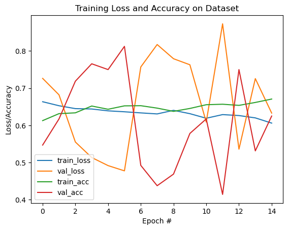
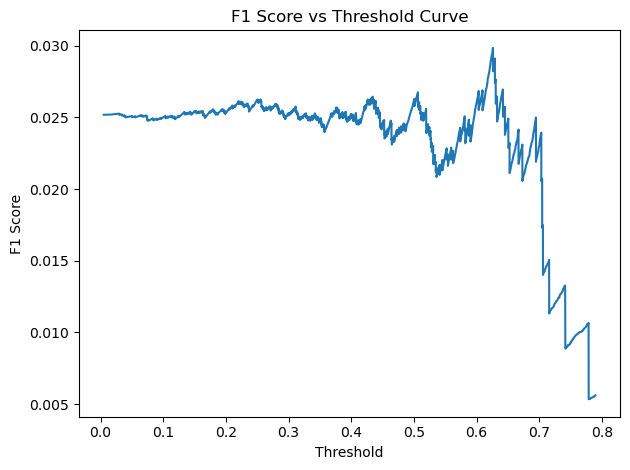
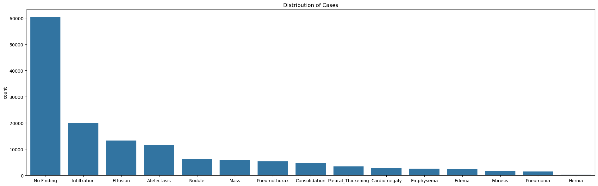

# FDA  Submission

**Wisnu Mulya**

**Pneumonia Detection Algorithm**

## Algorithm Description 

### 1. General Information

**Intended Use Statement:**
The intended use is for assisting the radiologist in the detection of pneumonia 
from chest X-ray images.

**Indications for Use:**
- Screening pneumonia studies
- Women and men of all age
- With or without comorbids

**Device Limitations:**
- The algorithm has low recall and precision: 6.29% and 1.96% respectively.

**Clinical Impact of Performance:**
- Low recall means that the true positives are few among the total of true positives
 and false negatives. The impact is that that negative results will not be a reliable
 sign that the image does not indicate pneumonia.
- Low precision means that the true positives are few among the total of true 
 positives and false positives. The impact is that positive results will not be a 
 reliable sign that the imae indicates pneumonia. 

### 2. Algorithm Design and Function

**DICOM Checking Steps:**
The DICOM file is checked of whether it is an X-ray image from a chest. Otherwise,
the algorithm will returns nothing.

**Preprocessing Steps:**
1. Image is rescaled to have the value from 0 to 1.
2. Image is replicated 3 times to fill in RGB channels.
3. Image is resized to 224x224 pixels.

**CNN Architecture:**
┃ Layer (type)                    ┃ Output Shape           ┃       Param # ┃
┡━━━━━━━━━━━━━━━━━━━━━━━━━━━━━━━━━╇━━━━━━━━━━━━━━━━━━━━━━━━╇━━━━━━━━━━━━━━━┩
│ functional_34 (Functional)      │ (None, 7, 7, 512)      │    14,714,688 │
├─────────────────────────────────┼────────────────────────┼───────────────┤
│ flatten_7 (Flatten)             │ (None, 25088)          │             0 │
├─────────────────────────────────┼────────────────────────┼───────────────┤
│ dropout_21 (Dropout)            │ (None, 25088)          │             0 │
├─────────────────────────────────┼────────────────────────┼───────────────┤
│ dense_28 (Dense)                │ (None, 256)            │     6,422,784 │
├─────────────────────────────────┼────────────────────────┼───────────────┤
│ dropout_22 (Dropout)            │ (None, 256)            │             0 │
├─────────────────────────────────┼────────────────────────┼───────────────┤
│ dense_29 (Dense)                │ (None, 128)            │        32,896 │
├─────────────────────────────────┼────────────────────────┼───────────────┤
│ dropout_23 (Dropout)            │ (None, 128)            │             0 │
├─────────────────────────────────┼────────────────────────┼───────────────┤
│ dense_30 (Dense)                │ (None, 64)             │         8,256 │
├─────────────────────────────────┼────────────────────────┼───────────────┤
│ dense_31 (Dense)                │ (None, 1)              │            65 │

The model consists of the initial first 18 layers of VGG16 (13 convolutional layers 
and 5 maxpool layers), 3 fully connected or dense layers, 3 dropout layers, and 
the final classification layer.

### 3. Algorithm Training

**Parameters:**
* Types of augmentation used during training are the following:
    * Horizontal flip,
    * Height shift with range 0.1
    * Width shift with range 0.1
    * Rotation with range 10 degrees
    * Shear with range 0.1
    * Zoom with range 0.1
* Batch size: 8
* Optimizer learning rate: 1e-3
* Layers of pre-existing architecture that were frozen: the first 17 layers of VGG16
* Layers of pre-existing architecture that were fine-tuned: the last convolutional layer
* Layers added to pre-existing architecture: 3 fully connected/dense layers, 3 dropout layers

**Final Threshold and Explanation:**
The threshold use for classifying pneumonia positive is 62.62%, which is the threshold
that maximises the F1 score, as seen from the F1 Score vs. Threshold Curve above.

### 4. Databases

The dataset used is the NIH chest x-rays from 2017, which can be accessed from [here](https://www.kaggle.com/datasets/nih-chest-xrays/data).
From the image above, it shows that 1.28% from 112,120 x-rays are found to have pneumonia.

**Description of Training Dataset:** 
The training dataset consists of 80% randomly selected x-rays with pneumonia from the
overall dataset and balanced with the same number of x-rays with no pneumonia found.
The training dataset consists of 2290 x-ray images in total.

**Description of Validation Dataset:** 
The validation dataset consists of 20% randomly selected x-rays with pneumonia from the
overall dataset and distributed among the non-pneumonia x-rays, so that the dataset has
the same pneumonia distribution as from the full dataset. The total x-ray images in this
dataset is 22,424.

### 5. Ground Truth
The ground truth of the dataset is obtained by using natural language processing (NLP) to text-mine
the findings from the radiology reports associated with the images. The NLP is expected
to have over 90% accuracy. The benefit of this dataset is the large amount of x-ray image data
which can be used to develop computer-aided detection and diagnosis devices (CADs). However,
the limitation of this dataset is the finding classification' accuracy which limits the
accuracy of the labels. On top of that, there could be human error introduced from the
original radiology report, which would compound the limitation of the labels' accuracy.

### 6. FDA Validation Plan

**Patient Population Description for FDA Validation Dataset:**
Women and men of all ages and with or without comorbids, and with racial distribution reflecting the
general US population. X-ray images of both positions (AP & PA) are included in the dataset.

**Ground Truth Acquisition Methodology:**
Acquired through concensus of three radiologists and weighted based on the seniority level.

**Algorithm Performance Standard:**
AUC and F1 score will be used to measure the algorithm performance based on [this journal](https://pmc.ncbi.nlm.nih.gov/articles/PMC9759647/)
which includes both of them as metrics of algorithm performances.
